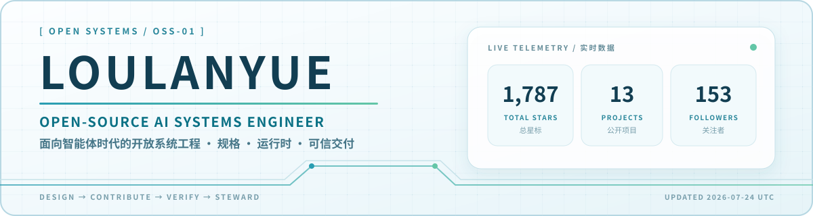
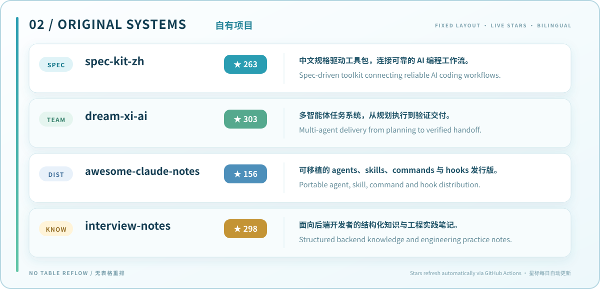
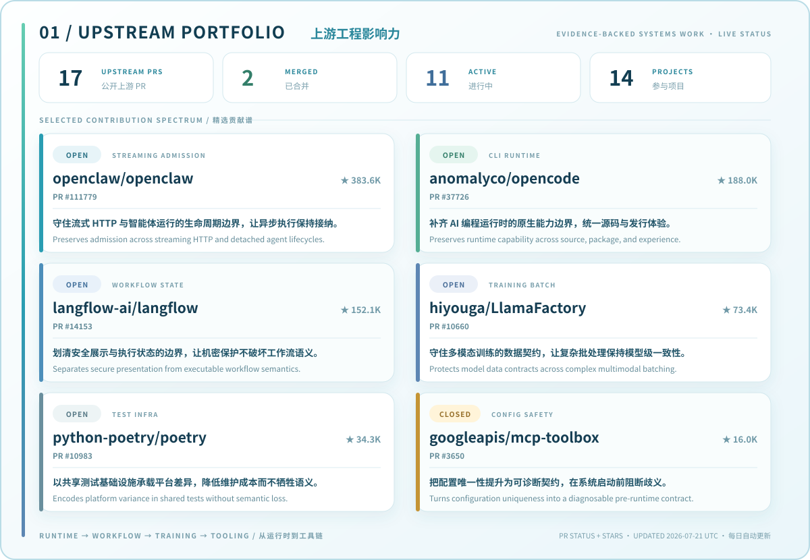

<p align="center">
  <a href="https://github.com/loulanyue?tab=repositories">
    
  </a>
</p>

<p align="center">
  <strong>构建面向智能体时代的开放基础设施，让规格、运行时、工作流与模型工程形成可演进的系统</strong><br />
  <sub>Building open infrastructure for the agentic era—where specifications, runtimes, workflows, and model engineering evolve as one system.</sub>
</p>

<p align="center">
  
</p>

<p align="center"><a href="https://github.com/loulanyue/spec-kit-zh"></a>&nbsp;<a href="https://github.com/loulanyue/dream-xi-ai"></a>&nbsp;<a href="https://github.com/loulanyue/awesome-claude-notes"></a>&nbsp;<a href="https://github.com/loulanyue/interview-notes"></a></p>

<p align="center">
  
</p>

<p align="center"><a href="https://github.com/openclaw/openclaw/pull/112478"></a>&nbsp;<a href="https://github.com/NousResearch/hermes-agent/pull/71997"></a>&nbsp;<a href="https://github.com/anomalyco/opencode/pull/38763"></a>&nbsp;<a href="https://github.com/langflow-ai/langflow/pull/14177"></a>&nbsp;<a href="https://github.com/hiyouga/LlamaFactory/pull/10660"></a>&nbsp;<a href="https://github.com/python-poetry/poetry/pull/10983"></a></p>

## `SYSTEMS THESIS / 系统主张`

```text
ZH  以开放基础设施连接规格、智能体、工作流与模型工程，让复杂 AI 系统可理解、可验证、可演进
EN  Open infrastructure connecting specifications, agents, workflows, and model engineering—so complex AI systems stay legible, verifiable, and evolvable
```

<p>
  
  
  
  
  
  
</p>

## `OPERATING PRINCIPLES / 工程原则`

```text
01  THINK IN SYSTEMS / 系统思考    02  GROUND IN EVIDENCE / 证据驱动    03  DESIGN FOR REVIEW / 面向审查    04  MAINTAIN FOR LONGEVITY / 长期维护
```

<p align="center">
  <a href="https://github.com/pulls?q=is%3Apr+author%3Aloulanyue"></a>
  <a href="https://github.com/loulanyue?tab=repositories"></a>
</p>

<p align="center">
  <sub>实时数据统计自有、公开、非 Fork 项目，每日自动刷新。<br />Live telemetry counts owned public non-fork repositories and refreshes daily.</sub>
</p>
